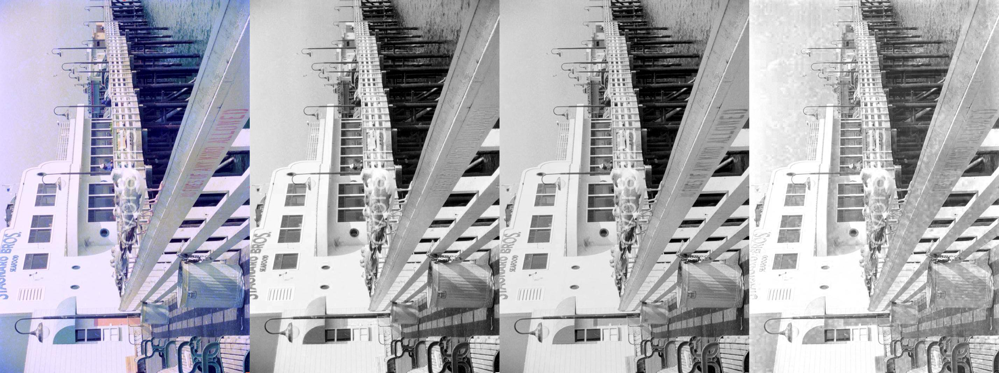

# BlueNeg: A 35mm Negative Film Dataset for Restoring Channel-Heterogeneous Deterioration

## Repo Contents

Due to the storage quota of GitHub, we only provide the LDR preview versions, meta data, and a limited number of HDR samples of our BlueNeg dataset in this repo. The full dataset will be publicly available on HuggingFace Hub upon publication. 

### Channel viewer

Here we show the RGB+R+G+B channels separately (converted into JPEG to save space, the original RGB for LDR preview is in PNG format):

- blue-corrupted: [link](./viewer/viewer-blue-corrupted-split/view.md)
- blue-intact: [link](./viewer/viewer-blue-intact-split/view.md)
- blue-corrupted-pseudogt: [link](./viewer/viewer-blue-corrupted-pgt-split/view.md)
- side-by-side-pseudogt: [link](./viewer/viewer-side-by-side/view.md)

### LDR data Viewer

Here we show the LDR preview versions of the negative films: 

- blue-corrupted: [link](./viewer/viewer-blue-corrupted/view.md)
- blue-intact: [link](./viewer/viewer-blue-intact/view.md)
- blue-corrupted-pseudogt: [link](./viewer/viewer-blue-corrupted-pgt/view.md)

### HDR sample data

#### blue-corrupted

Preview:

HDR downloads:
- [19960807A-12-new-orleans-siggraph96.dng](https://github.com/cvpr8223/cvpr8223/releases/download/rc0/19960807A-12-new-orleans-siggraph96.dng)
- [19960807A-12-new-orleans-siggraph96.tif](https://github.com/cvpr8223/cvpr8223/releases/download/rc0/19960807A-12-new-orleans-siggraph96.tif)

Preview: 

HDR downloads:
- [19960818H-34-san-francisco.dng](https://github.com/cvpr8223/cvpr8223/releases/download/rc0/19960818H-34-san-francisco.dng)
- [19960818H-34-san-francisco.tif](https://github.com/cvpr8223/cvpr8223/releases/download/rc0/19960818H-34-san-francisco.tif)

#### blue-intact

Preview: 

HDR downloads:
- [19960812D-14-las-vegas.dng](https://github.com/cvpr8223/cvpr8223/releases/download/rc0/19960812D-14-las-vegas.dng)
- [19960812D-14-las-vegas.tif](https://github.com/cvpr8223/cvpr8223/releases/download/rc0/19960812D-14-las-vegas.tif)

## Dataset Description

This set of images is collected for studying the research problem of restoring the corrupted negative films. Due to the physical nature of negative film, the red, green, and blue light-sensitive layers are located differently inside the negative film. Therefore, the rates of  deterioration of these three layers are different. The corresponding author found that the blue channel is relatively vulnerable compared to the other two channels. Because the blue light-sensitive layer is on the outermost layer on the emulsion side. That is, the deterioration rates are heterogeneous. This characteristic is inherited from its ancestor, i.e., storing the three color negatives (R, G, B) on three separate glass plates by Prokudin-Gorsky. 

Since the blue channel is more vulnerable and the other two channels are relatively well-preserved, this means we can restore the blue channel by exploiting the retained information from the red and green channels to restore the color photograph. This is especially sound with
the latest AI technologies. Unfortunately, most existing photo restoration techniques are developed based on printed photographs, in which the nature of deterioration is different from that of the negatives. This is why this dataset is created. 

## License

Our license shares the same spirit with the [CC-BY 4.0](https://creativecommons.org/licenses/by/4.0/). However, please note that our license is not CC-BY 4.0. Please check the LICENSE file for more details.

```
All photos are owned and copyrighted by (redacted). You are 
automatically granted with permission to use the images for academic 
and commerical usages, provided that the image credit 
"Copyrighted by (redacted)" is included in any forms of 
publication, reproduction, redistribution, or derivatives of the images.
```

## Meta Information

The meta information is stored in the `meta.json` and `transformations.pkl`. The meta information includes the following fields:

- `meta.json`
    - filename
    - partition
    - is_testset
    - date
    - roll_id
    - number_in_roll
    - location
    - geo_location
    - film_type 
    - negative_path
    - printed_path
    - preview_path
    - pseudogt_path
    - scene_property
        - is_indoor
        - is_daytime
- `transformations.pkl`: a python dict using filename (without extension) as key, and the value is a dict with the following fields:
    - matrix: the perspective projection matrix to warp the printed photo to the negative preview
    - bbox: the bounding box of the warped printed photo in the negative preview; the bounding box is in the format of [x0, y0, x1, y1], preview[y0:y1, x0:x1, :] has the same size as pseudo ground truth

## Naming Convention

`YYYYMMDD[R]-NN-NAME.EXT` 
- `YYYYMMDD`: The date when the photo was taken (might not always be accurate, but roughly correct).
- `[R]`: the roll number, if available
- `NN`: the photo number in the roll
- `NAME`: the photo's name, usually the location or the subject of the photo.
- `EXT`: the file extension, e.g., `.dng`, `.tif`, `.preview.png`, `.pseudogt.png`, etc.


## Data Information

<table style="border-collapse:collapse;border-spacing:0" class="tg"><thead>
<tr><th style="border-color:inherit;border-style:solid;border-width:1px;font-family:Arial, sans-serif;font-size:14px;font-weight:bold;overflow:hidden;padding:10px 5px;text-align:center;vertical-align:top;word-break:normal">Data Source</th><th style="border-color:inherit;border-style:solid;border-width:1px;font-family:Arial, sans-serif;font-size:14px;font-weight:bold;overflow:hidden;padding:10px 5px;text-align:center;vertical-align:top;word-break:normal">Partition</th><th style="border-color:inherit;border-style:solid;border-width:1px;font-family:Arial, sans-serif;font-size:14px;font-weight:bold;overflow:hidden;padding:10px 5px;text-align:center;vertical-align:top;word-break:normal">Number</th><th style="border-color:inherit;border-style:solid;border-width:1px;font-family:Arial, sans-serif;font-size:14px;font-weight:bold;overflow:hidden;padding:10px 5px;text-align:center;vertical-align:top;word-break:normal">Folder</th>
<th style="border-color:inherit;border-style:solid;border-width:1px;font-family:Arial, sans-serif;font-size:14px;font-weight:bold;overflow:hidden;padding:10px 5px;text-align:center;vertical-align:top;word-break:normal">Bits per channel</th><th style="border-color:inherit;border-style:solid;border-width:1px;font-family:Arial, sans-serif;font-size:14px;font-weight:bold;overflow:hidden;padding:10px 5px;text-align:center;vertical-align:top;word-break:normal">Resolution (may varies)</th><th style="border-color:inherit;border-style:solid;border-width:1px;font-family:Arial, sans-serif;font-size:14px;font-weight:bold;overflow:hidden;padding:10px 5px;text-align:center;vertical-align:top;word-break:normal">File extension</th><th style="border-color:inherit;border-style:solid;border-width:1px;font-family:Arial, sans-serif;font-size:14px;font-weight:bold;overflow:hidden;padding:10px 5px;text-align:center;vertical-align:top;word-break:normal">Public</th></tr>
</thead>
<tbody>
<tr><td style="border-color:inherit;border-style:solid;border-width:1px;font-family:Arial, sans-serif;font-size:14px;overflow:hidden;padding:10px 5px;text-align:center;vertical-align:top;word-break:normal" rowspan="2">Negative films</td><td style="border-color:inherit;border-style:solid;border-width:1px;font-family:Arial, sans-serif;font-size:14px;overflow:hidden;padding:10px 5px;text-align:center;vertical-align:top;word-break:normal">blue-corrupted</td><td style="border-color:inherit;border-style:solid;border-width:1px;font-family:Arial, sans-serif;font-size:14px;overflow:hidden;padding:10px 5px;text-align:center;vertical-align:top;word-break:normal">297</td><td style="border-color:inherit;border-style:solid;border-width:1px;font-family:Arial, sans-serif;font-size:14px;overflow:hidden;padding:10px 5px;text-align:center;vertical-align:top;word-break:normal" rowspan="2">negative-16bit</td>
<td style="border-color:inherit;border-style:solid;border-width:1px;font-family:Arial, sans-serif;font-size:14px;overflow:hidden;padding:10px 5px;text-align:center;vertical-align:top;word-break:normal" rowspan="2">16</td><td style="border-color:inherit;border-style:solid;border-width:1px;font-family:Arial, sans-serif;font-size:14px;overflow:hidden;padding:10px 5px;text-align:center;vertical-align:top;word-break:normal" rowspan="2">10,128 x 6,840</td><td style="border-color:inherit;border-style:solid;border-width:1px;font-family:Arial, sans-serif;font-size:14px;overflow:hidden;padding:10px 5px;text-align:center;vertical-align:top;word-break:normal" rowspan="2">dng</td><td style="border-color:inherit;border-style:solid;border-width:1px;font-family:Arial, sans-serif;font-size:14px;overflow:hidden;padding:10px 5px;text-align:center;vertical-align:top;word-break:normal" rowspan="2">Yes</td></tr>
<tr><td style="border-color:inherit;border-style:solid;border-width:1px;font-family:Arial, sans-serif;font-size:14px;overflow:hidden;padding:10px 5px;text-align:center;vertical-align:top;word-break:normal">blue-intact</td><td style="border-color:inherit;border-style:solid;border-width:1px;font-family:Arial, sans-serif;font-size:14px;overflow:hidden;padding:10px 5px;text-align:center;vertical-align:top;word-break:normal">194</td></tr>
<tr><td style="border-color:inherit;border-style:solid;border-width:1px;font-family:Arial, sans-serif;font-size:14px;overflow:hidden;padding:10px 5px;text-align:center;vertical-align:top;word-break:normal" rowspan="2">Printed photo</td><td style="border-color:inherit;border-style:solid;border-width:1px;font-family:Arial, sans-serif;font-size:14px;overflow:hidden;padding:10px 5px;text-align:center;vertical-align:top;word-break:normal">blue-corrupted</td><td style="border-color:inherit;border-style:solid;border-width:1px;font-family:Arial, sans-serif;font-size:14px;overflow:hidden;padding:10px 5px;text-align:center;vertical-align:top;word-break:normal">247</td><td style="border-color:inherit;border-style:solid;border-width:1px;font-family:Arial, sans-serif;font-size:14px;overflow:hidden;padding:10px 5px;text-align:center;vertical-align:top;word-break:normal" rowspan="2">printed-16bit</td>
<td style="border-color:inherit;border-style:solid;border-width:1px;font-family:Arial, sans-serif;font-size:14px;overflow:hidden;padding:10px 5px;text-align:center;vertical-align:top;word-break:normal" rowspan="2">16</td><td style="border-color:inherit;border-style:solid;border-width:1px;font-family:Arial, sans-serif;font-size:14px;overflow:hidden;padding:10px 5px;text-align:center;vertical-align:top;word-break:normal" rowspan="2">2,994 x 1,920</td><td style="border-color:inherit;border-style:solid;border-width:1px;font-family:Arial, sans-serif;font-size:14px;overflow:hidden;padding:10px 5px;text-align:center;vertical-align:top;word-break:normal" rowspan="2">tif</td><td style="border-color:inherit;border-style:solid;border-width:1px;font-family:Arial, sans-serif;font-size:14px;overflow:hidden;padding:10px 5px;text-align:center;vertical-align:top;word-break:normal" rowspan="2">Yes</td></tr>
<tr><td style="border-color:inherit;border-style:solid;border-width:1px;font-family:Arial, sans-serif;font-size:14px;overflow:hidden;padding:10px 5px;text-align:center;vertical-align:top;word-break:normal">blue-intact</td><td style="border-color:inherit;border-style:solid;border-width:1px;font-family:Arial, sans-serif;font-size:14px;overflow:hidden;padding:10px 5px;text-align:center;vertical-align:top;word-break:normal">151</td></tr>
<tr><td style="border-color:inherit;border-style:solid;border-width:1px;font-family:Arial, sans-serif;font-size:14px;overflow:hidden;padding:10px 5px;text-align:center;vertical-align:top;word-break:normal" rowspan="2">Negative preview (after negation)</td><td style="border-color:inherit;border-style:solid;border-width:1px;font-family:Arial, sans-serif;font-size:14px;overflow:hidden;padding:10px 5px;text-align:center;vertical-align:top;word-break:normal">blue-corrupted</td><td style="border-color:inherit;border-style:solid;border-width:1px;font-family:Arial, sans-serif;font-size:14px;overflow:hidden;padding:10px 5px;text-align:center;vertical-align:top;word-break:normal">297</td><td style="border-color:inherit;border-style:solid;border-width:1px;font-family:Arial, sans-serif;font-size:14px;overflow:hidden;padding:10px 5px;text-align:center;vertical-align:top;word-break:normal" rowspan="2">negative-preview-8bit</td>
<td style="border-color:inherit;border-style:solid;border-width:1px;font-family:Arial, sans-serif;font-size:14px;overflow:hidden;padding:10px 5px;text-align:center;vertical-align:top;word-break:normal" rowspan="2">8</td><td style="border-color:inherit;border-style:solid;border-width:1px;font-family:Arial, sans-serif;font-size:14px;overflow:hidden;padding:10px 5px;text-align:center;vertical-align:top;word-break:normal" rowspan="2">1,322 x 892</td><td style="border-color:inherit;border-style:solid;border-width:1px;font-family:Arial, sans-serif;font-size:14px;overflow:hidden;padding:10px 5px;text-align:center;vertical-align:top;word-break:normal" rowspan="2">preview.png</td><td style="border-color:inherit;border-style:solid;border-width:1px;font-family:Arial, sans-serif;font-size:14px;overflow:hidden;padding:10px 5px;text-align:center;vertical-align:top;word-break:normal" rowspan="2">Yes</td></tr>
<tr><td style="border-color:inherit;border-style:solid;border-width:1px;font-family:Arial, sans-serif;font-size:14px;overflow:hidden;padding:10px 5px;text-align:center;vertical-align:top;word-break:normal">blue-intact</td><td style="border-color:inherit;border-style:solid;border-width:1px;font-family:Arial, sans-serif;font-size:14px;overflow:hidden;padding:10px 5px;text-align:center;vertical-align:top;word-break:normal">194</td></tr>
<tr><td style="border-color:inherit;border-style:solid;border-width:1px;font-family:Arial, sans-serif;font-size:14px;overflow:hidden;padding:10px 5px;text-align:center;vertical-align:top;word-break:normal">Pseudo ground truth</td><td style="border-color:inherit;border-style:solid;border-width:1px;font-family:Arial, sans-serif;font-size:14px;overflow:hidden;padding:10px 5px;text-align:center;vertical-align:top;word-break:normal">blue-corrupted</td><td style="border-color:inherit;border-style:solid;border-width:1px;font-family:Arial, sans-serif;font-size:14px;overflow:hidden;padding:10px 5px;text-align:center;vertical-align:top;word-break:normal">247</td><td style="border-color:inherit;border-style:solid;border-width:1px;font-family:Arial, sans-serif;font-size:14px;overflow:hidden;padding:10px 5px;text-align:center;vertical-align:top;word-break:normal">pseudogt-8bit</td>
<td style="border-color:inherit;border-style:solid;border-width:1px;font-family:Arial, sans-serif;font-size:14px;overflow:hidden;padding:10px 5px;text-align:center;vertical-align:top;word-break:normal">8</td><td style="border-color:inherit;border-style:solid;border-width:1px;font-family:Arial, sans-serif;font-size:14px;overflow:hidden;padding:10px 5px;text-align:center;vertical-align:top;word-break:normal">&lt; 1,322 x 892</td><td style="border-color:inherit;border-style:solid;border-width:1px;font-family:Arial, sans-serif;font-size:14px;overflow:hidden;padding:10px 5px;text-align:center;vertical-align:top;word-break:normal">pseudogt.png</td><td style="border-color:inherit;border-style:solid;border-width:1px;font-family:Arial, sans-serif;font-size:14px;overflow:hidden;padding:10px 5px;text-align:center;vertical-align:top;word-break:normal">Yes</td></tr>
<tr><td style="border-color:inherit;border-style:solid;border-width:1px;font-family:Arial, sans-serif;font-size:14px;overflow:hidden;padding:10px 5px;text-align:center;vertical-align:top;word-break:normal">Printed photo (testset)</td><td style="border-color:inherit;border-style:solid;border-width:1px;font-family:Arial, sans-serif;font-size:14px;overflow:hidden;padding:10px 5px;text-align:center;vertical-align:top;word-break:normal">blue-corrupted</td><td style="border-color:inherit;border-style:solid;border-width:1px;font-family:Arial, sans-serif;font-size:14px;overflow:hidden;padding:10px 5px;text-align:center;vertical-align:top;word-break:normal">30</td><td style="border-color:inherit;border-style:solid;border-width:1px;font-family:Arial, sans-serif;font-size:14px;overflow:hidden;padding:10px 5px;text-align:center;vertical-align:top;word-break:normal">-</td>
<td style="border-color:inherit;border-style:solid;border-width:1px;font-family:Arial, sans-serif;font-size:14px;overflow:hidden;padding:10px 5px;text-align:center;vertical-align:top;word-break:normal">16</td><td style="border-color:inherit;border-style:solid;border-width:1px;font-family:Arial, sans-serif;font-size:14px;overflow:hidden;padding:10px 5px;text-align:center;vertical-align:top;word-break:normal">2,994 x 1,920</td><td style="border-color:inherit;border-style:solid;border-width:1px;font-family:Arial, sans-serif;font-size:14px;overflow:hidden;padding:10px 5px;text-align:center;vertical-align:top;word-break:normal">tif</td><td style="border-color:inherit;border-style:solid;border-width:1px;font-family:Arial, sans-serif;font-size:14px;overflow:hidden;padding:10px 5px;text-align:center;vertical-align:top;word-break:normal">No</td></tr>
<tr><td style="border-color:inherit;border-style:solid;border-width:1px;font-family:Arial, sans-serif;font-size:14px;overflow:hidden;padding:10px 5px;text-align:center;vertical-align:top;word-break:normal">Pseudo ground truth (testset)</td><td style="border-color:inherit;border-style:solid;border-width:1px;font-family:Arial, sans-serif;font-size:14px;overflow:hidden;padding:10px 5px;text-align:center;vertical-align:top;word-break:normal">blue-corrupted</td><td style="border-color:inherit;border-style:solid;border-width:1px;font-family:Arial, sans-serif;font-size:14px;overflow:hidden;padding:10px 5px;text-align:center;vertical-align:top;word-break:normal">30</td><td style="border-color:inherit;border-style:solid;border-width:1px;font-family:Arial, sans-serif;font-size:14px;overflow:hidden;padding:10px 5px;text-align:center;vertical-align:top;word-break:normal">-</td>
<td style="border-color:inherit;border-style:solid;border-width:1px;font-family:Arial, sans-serif;font-size:14px;overflow:hidden;padding:10px 5px;text-align:center;vertical-align:top;word-break:normal">8</td><td style="border-color:inherit;border-style:solid;border-width:1px;font-family:Arial, sans-serif;font-size:14px;overflow:hidden;padding:10px 5px;text-align:center;vertical-align:top;word-break:normal">&lt; 1,322 x 892</td><td style="border-color:inherit;border-style:solid;border-width:1px;font-family:Arial, sans-serif;font-size:14px;overflow:hidden;padding:10px 5px;text-align:center;vertical-align:top;word-break:normal">pseudogt.png</td><td style="border-color:inherit;border-style:solid;border-width:1px;font-family:Arial, sans-serif;font-size:14px;overflow:hidden;padding:10px 5px;text-align:center;vertical-align:top;word-break:normal">No</td></tr>
</tbody></table>


